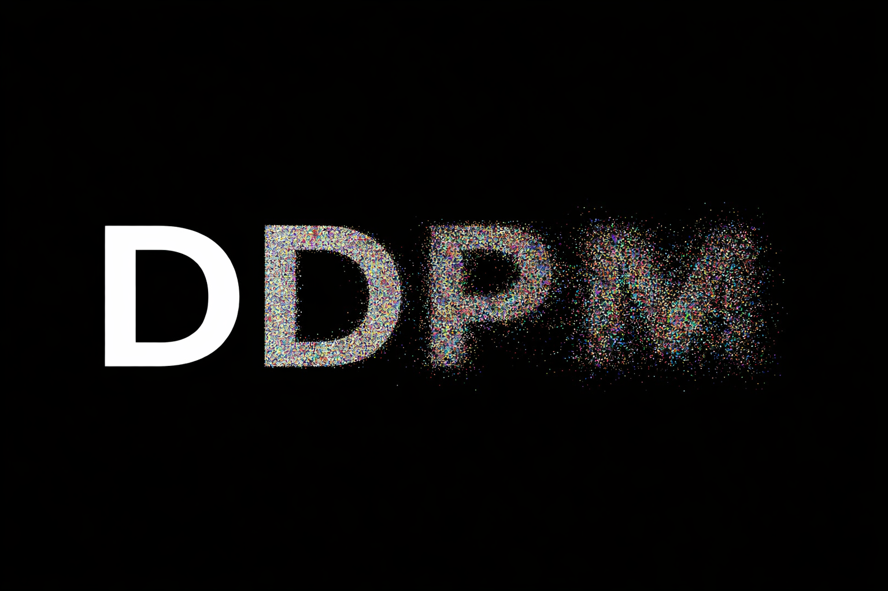

  

  

    <i>Logo generated by a DDPM-based diffusion model</i>
  

  
  <h1>Denoising Diffusion Probabilistic Models (DDPM)</h1>
  <h3>A Rigorous Theoretical Analysis & State of the Art Review</h3>

  

    <b>Bachelor's Thesis Project</b> | University of Cassino and Southern Lazio
     
    Computer and Telecommunications Engineering
  

  
  
  

 

---

## 📖 Abstract

This repository contains the theoretical framework and analytical work developed for my Bachelor's thesis, entitled **“Text-to-Image Generators: State of the Art”**.

The thesis is a comprehensive theoretical investigation that moves beyond black-box descriptions of generative models, aiming instead to provide a rigorous mathematical analysis of **Denoising Diffusion Probabilistic Models (DDPMs)**. 

The discussion is grounded at the intersection of non-equilibrium thermodynamics, stochastic processes, and variational inference, which together constitute the theoretical foundation of modern diffusion-based generative modeling.

## 🎯 Scope and Theoretical Contributions

- **Conceptual Framing of Text-to-Image Generation**  
  A rigorous contextual discussion of contemporary text-to-image systems (e.g. Midjourney, DALL·E 2, Stable Diffusion), aimed at motivating the emergence and relevance of diffusion-based generative models, without delving into implementation-specific aspects (Chapter 2).

- **Probabilistic Foundations of DDPMs**  
  A formal and self-contained treatment of Denoising Diffusion Probabilistic Models as coupled Markov chains, including the explicit definition of forward and reverse stochastic processes, Gaussian transition kernels, and diffusion schedules (Chapter 3).

- **Variational Derivation of the Training Objective**  
  A complete mathematical derivation of the DDPM training objective, starting from the intractable negative log-likelihood and proceeding through the Variational Lower Bound (ELBO), ultimately leading to the simplified noise-prediction loss adopted in practice (Appendix B).

- **Didactic and Self-Contained Mathematical Exposition**  
  Extensive appendices providing all the necessary background in probability theory, stochastic processes, variational inference, and neural network architectures (notably U-Net), making the thesis fully self-contained from a theoretical perspective (Appendices A–C).

> [!NOTE]  
> This work is intentionally theoretical in nature. No original architectures are proposed, and no models are trained or benchmarked.  
> The primary objective is to provide a mathematically rigorous understanding of diffusion-based generative models, suitable for academic study and as a foundation for further research.

---

## 🧠 Theoretical Framework Deconstructed

The core of the thesis investigates how diffusion models learn an implicit representation of the data distribution $p(x_0)$ by reversing a gradual and structured stochastic noising process.

<b>▶️ The Forward Diffusion Process (Markovian Corruption)</b> (Click to expand)

 

The forward process, denoted as $q$, is defined as a fixed Markov chain that gradually adds Gaussian noise to the data $x_0$ over $T$ timesteps, according to a predefined variance schedule $\beta_t$.

The joint probability of the complete sequence is factorized as:

$$q(x_{1:T} | x_0) := \prod_{t=1}^T q(x_t | x_{t-1})$$

Where each individual transition is a Gaussian kernel ensures mathematical tractability:

$$q(x_t | x_{t-1}) := \mathcal{N}(x_t; \sqrt{1-\beta_t}x_{t-1}, \beta_t \mathbf{I})$$

A critical property derived in the work is the ability to sample $x_t$ at any arbitrary timestep directly from $x_0$ via the **reparameterization trick**, without iterating through intermediate steps:

$$x_t = \sqrt{\bar{\alpha}_t}x_0 + \sqrt{1-\bar{\alpha}_t}\epsilon \quad \text{where } \epsilon \sim \mathcal{N}(0, \mathbf{I})$$

As $T \to \infty$, the data structure is completely destroyed, converging to pure isotropic Gaussian noise.

<b>◀️ The Reverse Process & Optimization Objective</b> (Click to expand)

 

Generative modeling requires inverting the diffusion. Since the true posterior $q(x_{t-1}|x_t)$ is intractable, we approximate it using a learned Markov chain $p_\theta$ with parameterized Gaussian transitions:

$$p_\theta(x_{t-1} | x_t) := \mathcal{N}(x_{t-1}; \mu_\theta(x_t, t), \Sigma_\theta(x_t, t))$$

Training is performed by minimizing the variational upper bound on the negative log-likelihood. The thesis details the complex derivation showing that this objective can be simplified to learning a neural network $\epsilon_\theta$ that predicts the noise component $\epsilon$ added at timestep $t$.

This results in the highly effective **simple loss function**:

$$L_{\text{simple}}(\theta) := \mathbb{E}_{x_0, \epsilon, t} \[\| \epsilon - \epsilon_\theta(\sqrt{\bar{\alpha}_t}x_0 + \sqrt{1-\bar{\alpha}_t}\epsilon, t) \|^2 ]$$

where $\mathbf{x}_t (\mathbf{x}_0, t) = \sqrt{\bar{\alpha}_t}\mathbf{x}_0 + \sqrt{1 - \bar{\alpha}_t} \boldsymbol{\epsilon}$ and $\boldsymbol{\epsilon} \sim \mathcal{N}(0, \mathbf{I})$.

This formulation elegantly reduces the complex generative task to a sequence of denoising score matching problems.

---

## 📂 Thesis Structure

The associated dissertation is structured as follows:
* **Chapter 1:** Introduction to Generative Deep Learning context.
* **Chapter 2:** Technical review of SOTA Text-to-Image architectures.
* **Chapter 3:** Mathematical formulation of DDPMs (Forward/Reverse processes).
* **Appendices:** Deep dives into VAEs, ELBO derivation, and U-Net architecture.

---

## 📚 Foundational Reference

> [!IMPORTANT]
> The theoretical backbone of this thesis is grounded in the seminal work that introduced modern Denoising Diffusion Probabilistic Models:  
>  
> **Denoising Diffusion Probabilistic Models**  
> Jonathan Ho, Ajay Jain, Pieter Abbeel  
> *NeurIPS 2020*  
> [➡️ Read on arXiv (2006.11239)](https://arxiv.org/abs/2006.11239)

---

    
<i>Author: Giuseppe Alfieri | Supervisor: Prof. Alessandro Bria</i>

    
Academic Year 2022/2023

