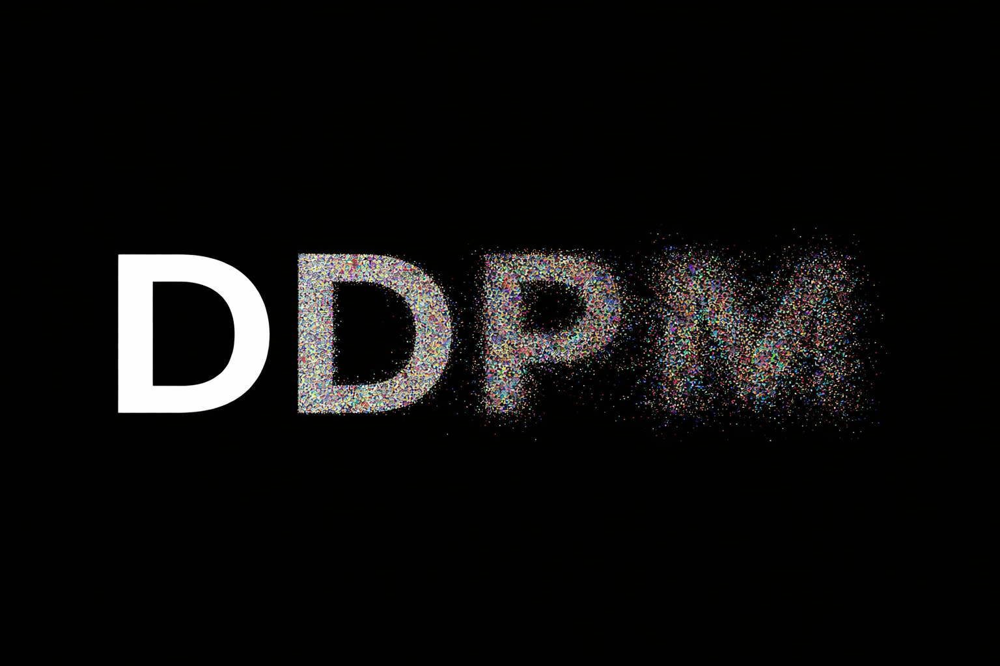

<div align="center">
  

  <p><i>Logo generated with a DDPM-based diffusion model</i></p>

  <h1>Denoising Diffusion Probabilistic Models</h1>
  <h3>A Self-Contained Mathematical Treatment</h3>

  <p>
    <b>Bachelor's Thesis</b> &nbsp;·&nbsp; University of Cassino and Southern Lazio<br>
    Department of Electrical and Information Engineering “Maurizio Scarano”<br>
    B.Sc. in Computer and Telecommunications Engineering &nbsp;·&nbsp; A.Y. 2022/2023
  </p>

  <p>
    <a href="main.pdf"></a>
    
    
    
    <a href="https://arxiv.org/abs/2006.11239"></a>
  </p>
</div>

---

## Overview

This repository contains the LaTeX sources and the compiled PDF of my Bachelor's thesis, *Generatori di immagini da prompt testuali: stato dell'arte* (**Text-to-Image Generators: State of the Art**), supervised by Prof. Alessandro Bria.

The thesis is a theoretical study of **Denoising Diffusion Probabilistic Models** (DDPMs), the class of generative models introduced by Ho, Jain and Abbeel (2020) that underlies contemporary text-to-image systems such as Stable Diffusion, Imagen and DALL·E 2. Its aim is to replace the black-box account of these systems with a derivation that is complete in the mathematical sense: every object is defined before it is used, every step of the training objective is carried out explicitly, and all prerequisites — probability theory, Markov chains, variational inference, the U-Net architecture — are supplied in appendices rather than assumed.

> [!NOTE]
> **The thesis text is written in Italian.** This README is in English and summarises the content and the mathematical framework; the equations below are those developed in Chapter 2 and Appendix B of the dissertation.

> [!IMPORTANT]
> **Scope.** This is a work of exposition and analysis, not of experimentation. No novel architecture is proposed, and no model is trained or benchmarked. Reported empirical results (e.g. FID scores) are cited from the literature and attributed as such. What the work contributes is a rigorous, self-contained and pedagogically ordered derivation of the DDPM framework.

---

## What the thesis establishes

**Positioning within generative modelling.** Generative modelling is contrasted with discriminative modelling, and a taxonomy of maximum-likelihood generative models is developed, following Goodfellow (2016) and Foster (2023), according to how each family represents the density $p_{\boldsymbol{\theta}}(\mathbf{x})$: explicitly and tractably, explicitly but approximately, or implicitly. DDPMs are located within this taxonomy among the models that optimise an explicit approximation — a variational lower bound (Chapter 1).

**Formalisation of the diffusion mechanism.** The forward and reverse processes are defined as coupled Markov chains with Gaussian transition kernels. The variance schedule, the closed-form marginal $q(\mathbf{x}_t \mid \mathbf{x}_0)$, the tractable posterior $q(\mathbf{x}_{t-1} \mid \mathbf{x}_t, \mathbf{x}_0)$, the training procedure and the ancestral sampling procedure are each treated in a dedicated section (Chapter 2).

**Derivation of the training objective.** Starting from the intractable negative log-likelihood, the variational bound is obtained by specialising the VAE lower bound of Kingma and Welling to the diffusion setting, then decomposed term by term and finally reduced to the simplified noise-prediction loss actually minimised in practice. The full chain of equalities is reproduced, with the justification of each step stated (Appendix B).

**Mathematical prerequisites.** Probability distributions, expectation and variance, statistical independence, the Gaussian and multivariate Gaussian, Markov chains and maximum-likelihood estimation are collected in Appendix A; the U-Net of Ronneberger et al. (2015), including the down/up-sampling blocks and skip connections, in Appendix C. The thesis is therefore readable without external references.

**Ethical discussion.** The concluding chapter examines two documented consequences of deployed text-to-image systems: the propagation of dataset bias — including OpenAI's undisclosed prompt injection in DALL·E — and the circulation of synthetic imagery of real events, with the Amnesty International and Adobe Stock cases as evidence (Chapter 3).

---

## The mathematical framework

Throughout, $\mathbf{x}_0 \sim q(\mathbf{x}_0)$ denotes a sample from the (unknown) data distribution, $\mathbf{x}_{1:T}$ the latent variables produced by successive corruption, and $\{\beta_t\}_{t=1}^{T} \subset (0,1)$ a fixed, monotonically increasing *variance schedule*. It is convenient to set

$$\alpha_t := 1 - \beta_t, \qquad \bar{\alpha}_t := \prod_{s=1}^{t} \alpha_s .$$

<details>
<summary><b>The forward process — Markovian corruption</b></summary>

<br>

The forward (or *diffusion*) process $q$ is a **fixed** Markov chain — it contains no learnable parameters — that gradually adds Gaussian noise to $\mathbf{x}_0$ over $T$ timesteps. By the Markov property the joint law of the trajectory factorises as

$$q(\mathbf{x}_{1:T} \mid \mathbf{x}_0) := \prod_{t=1}^{T} q(\mathbf{x}_t \mid \mathbf{x}_{t-1}),$$

and each transition kernel is chosen Gaussian, which is what makes the whole construction tractable:

$$q(\mathbf{x}_t \mid \mathbf{x}_{t-1}) := \mathcal{N}\!\left(\mathbf{x}_t ; \sqrt{1-\beta_t}\,\mathbf{x}_{t-1},\ \beta_t \mathbf{I}\right).$$

The scaling factor $\sqrt{1-\beta_t}$ is not incidental: it is precisely the choice that keeps the variance of the chain bounded, so that the marginals converge rather than diverge.

**Closed-form marginal.** Because a composition of Gaussian kernels of this form is again Gaussian, $\mathbf{x}_t$ can be sampled *directly* from $\mathbf{x}_0$, without iterating through the intermediate states:

$$q(\mathbf{x}_t \mid \mathbf{x}_0) = \mathcal{N}\!\left(\mathbf{x}_t ; \sqrt{\bar{\alpha}_t}\,\mathbf{x}_0,\ (1-\bar{\alpha}_t)\mathbf{I}\right),$$

equivalently, via the reparameterisation trick,

$$\mathbf{x}_t = \sqrt{\bar{\alpha}_t}\,\mathbf{x}_0 + \sqrt{1-\bar{\alpha}_t}\,\boldsymbol{\epsilon}, \qquad \boldsymbol{\epsilon} \sim \mathcal{N}(\mathbf{0}, \mathbf{I}).$$

This identity is what makes training feasible at all: a single timestep $t$ may be sampled uniformly and its loss evaluated in constant time.

**Limiting behaviour.** Since $\alpha_s \in (0,1)$ for every $s$, the product $\bar{\alpha}_t$ is strictly decreasing; provided the schedule is such that $\bar{\alpha}_T \to 0$, the marginal $q(\mathbf{x}_T \mid \mathbf{x}_0)$ converges to $\mathcal{N}(\mathbf{0}, \mathbf{I})$ irrespective of $\mathbf{x}_0$. All structure in the datum is destroyed, and the terminal distribution is isotropic Gaussian noise — a distribution that is trivial to sample from. This is the entire point of running the chain forward.

</details>

<details>
<summary><b>The reverse process — learned Gaussian denoising</b></summary>

<br>

Generation requires traversing the chain in the opposite direction. The true reverse conditional $q(\mathbf{x}_{t-1} \mid \mathbf{x}_t)$ is intractable, since it depends on the unknown $q(\mathbf{x}_0)$ through Bayes' rule. It is therefore approximated by a **learned** Markov chain $p_{\boldsymbol{\theta}}$ with Gaussian transitions:

$$p_{\boldsymbol{\theta}}(\mathbf{x}_{0:T}) := p(\mathbf{x}_T) \prod_{t=1}^{T} p_{\boldsymbol{\theta}}(\mathbf{x}_{t-1} \mid \mathbf{x}_t), \qquad p(\mathbf{x}_T) = \mathcal{N}(\mathbf{0}, \mathbf{I}),$$

$$p_{\boldsymbol{\theta}}(\mathbf{x}_{t-1} \mid \mathbf{x}_t) := \mathcal{N}\!\left(\mathbf{x}_{t-1} ; \boldsymbol{\mu}_{\boldsymbol{\theta}}(\mathbf{x}_t, t),\ \boldsymbol{\Sigma}_{\boldsymbol{\theta}}(\mathbf{x}_t, t)\right).$$

The Gaussian form is not an arbitrary modelling convenience. When the $\beta_t$ are small, the true reverse conditional is itself approximately Gaussian, so the family is well matched to the target. Ho et al. further fix the covariance to $\boldsymbol{\Sigma}_{\boldsymbol{\theta}}(\mathbf{x}_t,t) = \sigma_t^2 \mathbf{I}$ with $\sigma_t^2$ untrained, leaving only the mean to be learned.

**The tractable posterior.** Although $q(\mathbf{x}_{t-1} \mid \mathbf{x}_t)$ is intractable, conditioning additionally on $\mathbf{x}_0$ yields a Gaussian available in closed form,

$$q(\mathbf{x}_{t-1} \mid \mathbf{x}_t, \mathbf{x}_0) = \mathcal{N}\!\left(\mathbf{x}_{t-1} ; \tilde{\boldsymbol{\mu}}_t(\mathbf{x}_t, \mathbf{x}_0),\ \tilde{\beta}_t \mathbf{I}\right),$$

$$\tilde{\boldsymbol{\mu}}_t(\mathbf{x}_t, \mathbf{x}_0) = \frac{\sqrt{\bar{\alpha}_{t-1}}\,\beta_t}{1-\bar{\alpha}_t}\,\mathbf{x}_0 + \frac{\sqrt{\alpha_t}\,(1-\bar{\alpha}_{t-1})}{1-\bar{\alpha}_t}\,\mathbf{x}_t, \qquad \tilde{\beta}_t = \frac{1-\bar{\alpha}_{t-1}}{1-\bar{\alpha}_t}\,\beta_t .$$

This is the object that makes the variational bound computable: it supplies a Gaussian *target* against which each learned transition can be compared in closed form, rather than by Monte Carlo estimation.

</details>

<details>
<summary><b>The training objective — from the ELBO to the simplified loss</b></summary>

<br>

The likelihood $p_{\boldsymbol{\theta}}(\mathbf{x}_0) = \int p_{\boldsymbol{\theta}}(\mathbf{x}_{0:T})\,\mathrm{d}\mathbf{x}_{1:T}$ is intractable, so the negative log-likelihood is bounded above by a variational quantity. Regarding $\mathbf{x}_0$ as observed and $\mathbf{x}_{1:T}$ as latent, the VAE bound of Kingma and Welling specialises to

$$-\log p_{\boldsymbol{\theta}}(\mathbf{x}_0) \ \leq\ \mathbb{E}_{q}\!\left[-\log \frac{p_{\boldsymbol{\theta}}(\mathbf{x}_{0:T})}{q(\mathbf{x}_{1:T}\mid\mathbf{x}_0)}\right] \ =:\ L_{\mathrm{vlb}} .$$

Appendix B reproduces this derivation in full, and then decomposes $L_{\mathrm{vlb}}$ into per-timestep terms, each of which is a Kullback–Leibler divergence between two Gaussians and therefore admits a closed form:

$$L_{\mathrm{vlb}} = \underbrace{D_{\mathrm{KL}}\!\left(q(\mathbf{x}_T\mid\mathbf{x}_0)\,\|\,p(\mathbf{x}_T)\right)}_{L_T} + \sum_{t>1} \underbrace{D_{\mathrm{KL}}\!\left(q(\mathbf{x}_{t-1}\mid\mathbf{x}_t,\mathbf{x}_0)\,\|\,p_{\boldsymbol{\theta}}(\mathbf{x}_{t-1}\mid\mathbf{x}_t)\right)}_{L_{t-1}} \underbrace{-\ \log p_{\boldsymbol{\theta}}(\mathbf{x}_0\mid\mathbf{x}_1)}_{L_0} .$$

The term $L_T$ carries no learnable parameters and is discarded. Each $L_{t-1}$ reduces to a weighted squared error between $\tilde{\boldsymbol{\mu}}_t$ and $\boldsymbol{\mu}_{\boldsymbol{\theta}}$; reparameterising $\boldsymbol{\mu}_{\boldsymbol{\theta}}$ so that the network predicts the noise $\boldsymbol{\epsilon}$ rather than the mean, and discarding the resulting timestep-dependent weights, yields the objective minimised in practice:

$$L_{\mathrm{simple}}(\boldsymbol{\theta}) := \mathbb{E}_{\mathbf{x}_0,\ \boldsymbol{\epsilon},\ t}\left[\left\lVert \boldsymbol{\epsilon} - \boldsymbol{\epsilon}_{\boldsymbol{\theta}}\!\left(\sqrt{\bar{\alpha}_t}\,\mathbf{x}_0 + \sqrt{1-\bar{\alpha}_t}\,\boldsymbol{\epsilon},\ t\right)\right\rVert^2\right],$$

with $\boldsymbol{\epsilon} \sim \mathcal{N}(\mathbf{0},\mathbf{I})$ and $t \sim \mathcal{U}\{1,\dots,T\}$. Note that the dropped weighting means $L_{\mathrm{simple}}$ is *not* the variational bound itself, but a reweighting of it — one that empirically improves sample quality.

The generative problem has thus been reduced to a supervised regression: predicting, from a noisy image and a timestep, the noise that produced it. This is exactly the form of denoising score matching, a correspondence made explicit by Ho et al.

</details>

---

## Repository layout

| Path | Contents |
| :--- | :--- |
| [`main.pdf`](main.pdf) | **Compiled thesis.** Start here. |
| `main.tex` | Master document: preamble, package configuration, inclusion order. |
| `customization.sty` | Custom preamble — theorem environments, styling, macros. |
| `FrontMatter/` | Title page, dedication, abstract. |
| `MainMatter/Introduzione/` | Introduction. |
| `MainMatter/Chapters/Chap1/` | Ch. 1 — *Generative modelling*: generative vs. discriminative, taxonomy of generative models. |
| `MainMatter/Chapters/Chap2/` | Ch. 2 — *Diffusion models*: the DDPM pipeline, forward and reverse processes, training, sampling, performance. |
| `MainMatter/Chapters/Chap3/` | Ch. 3 — *Conclusions*, including the ethical discussion. |
| `MainMatter/Appendix/` | App. A — probability and statistics; App. B — derivation of the DDPM loss; App. C — the U-Net. |
| `Images/` | Figures (PDF/SVG) and standalone TikZ sources. |
| `BackMatter/` | Bibliography (`Tesi.bib`) and acknowledgements. |
| `docs/` | Assets for this README. |

---

## Building from source

The document is a `book`-class LaTeX project using `biblatex` with the **biber** backend, and requires shell-escape for the `svg` package. A [`arara`](https://islandoftex.github.io/arara/) directive block at the top of `main.tex` encodes the full build:

```bash
arara main.tex
```

Equivalently, by hand:

```bash
pdflatex -shell-escape main.tex
biber main
pdflatex -shell-escape main.tex
pdflatex -shell-escape main.tex
```

Two final passes are required for cross-references, the table of contents and the bibliography to settle. Compilation additionally requires **Inkscape** on the `PATH`, since `svg` converts the `.svg` figures at build time.

---

## References

The theoretical backbone of the thesis rests on the following works; the complete bibliography is in `BackMatter/Tesi.bib`.

- J. Ho, A. Jain, P. Abbeel. **Denoising Diffusion Probabilistic Models.** *NeurIPS*, 2020. [arXiv:2006.11239](https://arxiv.org/abs/2006.11239) — the primary reference.
- J. Sohl-Dickstein, E. A. Weiss, N. Maheswaranathan, S. Ganguli. **Deep Unsupervised Learning using Nonequilibrium Thermodynamics.** *ICML*, 2015. [arXiv:1503.03585](https://arxiv.org/abs/1503.03585) — the thermodynamic origin of the diffusion formulation.
- P. Dhariwal, A. Nichol. **Diffusion Models Beat GANs on Image Synthesis.** *NeurIPS*, 2021. [arXiv:2105.05233](https://arxiv.org/abs/2105.05233) — the empirical result establishing diffusion models as state of the art.
- D. P. Kingma, M. Welling. **Auto-Encoding Variational Bayes.** *ICLR*, 2014. [arXiv:1312.6114](https://arxiv.org/abs/1312.6114) — the variational bound specialised in Appendix B.
- O. Ronneberger, P. Fischer, T. Brox. **U-Net: Convolutional Networks for Biomedical Image Segmentation.** *MICCAI*, 2015. [arXiv:1505.04597](https://arxiv.org/abs/1505.04597) — the architecture of Appendix C.
- I. Goodfellow. **NIPS 2016 Tutorial: Generative Adversarial Networks.** [arXiv:1701.00160](https://arxiv.org/abs/1701.00160) — the taxonomy adopted in Chapter 1.
- D. Foster. **Generative Deep Learning.** 2nd ed., O'Reilly, 2023.

---

## Citation

```bibtex
@thesis{alfieri2023ddpm,
  author      = {Alfieri, Giuseppe},
  title       = {Generatori di immagini da prompt testuali: stato dell'arte},
  type        = {Bachelor's Thesis},
  institution = {Universit\`a degli Studi di Cassino e del Lazio Meridionale},
  address     = {Cassino, Italy},
  year        = {2023},
  url         = {https://github.com/giusalfieri/Bachelor-Thesis}
}
```

---

<div align="center">
  <sub><b>Giuseppe Alfieri</b> &nbsp;·&nbsp; Supervisor: Prof. Alessandro Bria &nbsp;·&nbsp; Academic Year 2022/2023</sub>
</div>
